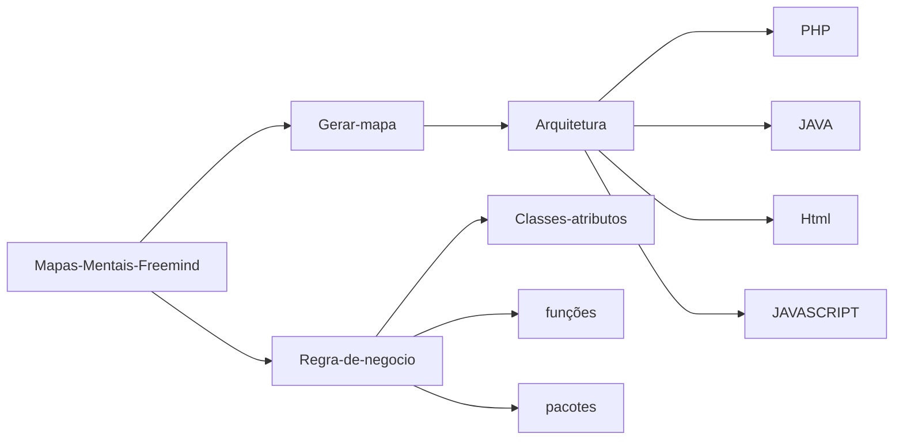
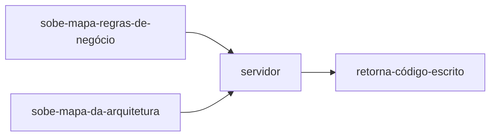
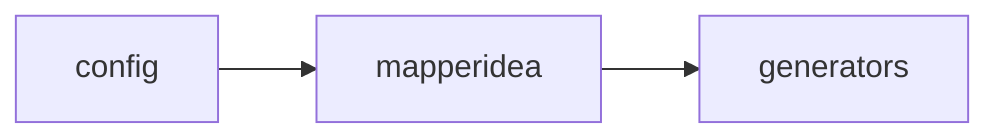
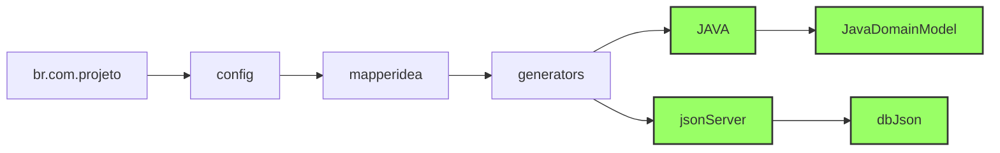
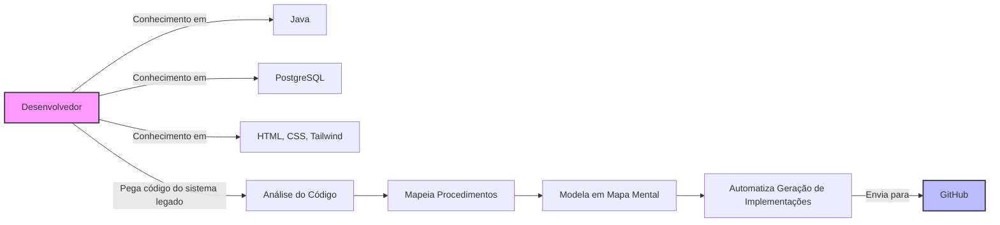

# MapperIdea

# Índice

1. [Introdução](#introdução)
    1. [Pré-Requisitos](#Pré-Requisitos)
    2. [Principais conceitos](#Principais-conceitos-MaperIDea)
2. [Softwares Utilizados](#SOFTWARES-UTILIZADOS)
3. [Instalação e uso da ferramenta](#INSTALAÇÃO-E-USO-DA-FERRAMENTA)
4. [Classes e atributos](#Classes-e-atributos)
5. [Mapeando Códigos](https://github.com/HamiltonVentura/MapperIdea-Java/blob/main/mapeando-codigo.md)
6. [Referências](#referências)

## Introdução

MapperIdea é uma ferramenta que automatiza a geração de código em conjunto com o Freemind, uma ferramenta de mapas mentais. Usando MapperIdea, é possível converter mapas mentais em código, o que facilita o desenvolvimento de software e aproxima os stakeholders do projeto, tornando a colaboração mais eficiente e compreensível para todos os envolvidos.

### Mapperidea
__Finalidade da Ferramenta :__
Agilizar o desenvolvimento de Software com mapas mentais, possibilitando reaproveitamento de código através da arquitetura modelada pelo Desenvolvedor / Analista.
*Ideia : "Criar na unha  apenas uma vez"*
* observação: não recomendo a ferramenta,  para desenvolver softwares do zero. Extremamente moroso.

#### Pré-Requisitos
>[!IMPORTANT]
>**Para modeladores de regras de negócio** <br>
> Conceito de classes, atributos e propriedade <br>
> Os principais conceitos de Orientação a objetos <br>

#### Principais conceitos MaperIDea
>[!IMPORTANT]
>**Para programdores**<br>
> 1 - O **XML** é de extrema importância pois os documentos gerados pela Estrutura gerada são em mm que é um tipo de arquivo  Em sua base XML.<br>
> 2 - O **XPATH** Básico é essência para utilização do MI (MapperIdea) , através dele é possível correr os documentos XML. <br>
> 3 - O **XQUERY** facilita o entendimento da aplicação das funções dentro de Mapperidea.<br>
> 4 - **Orientação a Objetos** os principais conceitos.

## SOFTWARES UTILIZADOS 
- NODE 12 
- Freemind 1.0 + pacote de icones 

> O mapeamento é um processo em que os membros da equipe de desenvolvimento podem executar, envolve "copiar" o codigo traduzindo-o em mapas mentais, 
> os quais poderão se alterados atualizados uma vez montados, sem necessidade de alterar código "na unha".

Após efetuar os mapeamentos, é necessário executar via linha de comando a geração de códigos, que é uma conversão do codigo mapeado em codigos práticos.
A baixo é uma ilustração de como é o processo de criação dos mapas.


O fluxo de utilização dos mapas mentais funciona da seguinte forma, O Mapperidea utiliza o código gerado pelos mapas mentais, sobe para o servidor essas informações, e como retorno ele traz o código escrito na arquitetura escolhida que foi construida.


A idéia principal é após mapeamento do código da arquitetura, alterar apenas os mapas mentais de regra de negócio, automatizando assim os processos referentes a codificação do sistema em construção ou alteração.


## INSTALAÇÃO E USO DA FERRAMENTA
#### Instalar antes o node versão 14
  **Para Linux**
~~~bash
sudo apt install npm
~~~
**para Windows**
~~~bash
choco install nodejs-lts --version=14.17.6
~~~

~~~bash
npm install mapperidea-cli -g
~~~

- teste usando o comando 

~~~bash
mi -h
~~~

 - Na sequência utilize  com os dados fornecidos pela Mapperidea para autorizar seus acessos.
```authorize|a <email> <machine> <server>```


### Observações: ###

- inicialize o projeto com o nome do projeto e o nome do arquivo

mi init <nome do projeto> <arquivo.mm>
Atualize o projeto subindo as informações para o servidor
mi push <nome do projeto>
O fluxo repetitivo do projeto é sempre alterar o arquivo, dar um push no servidor para atualização, e então utilizar o comando para geração de código.


### ICONOGRAFIA ####
Para adicionar um ícone a qualquer um de seus nós em seu mapa mental utilize a tecla de atalho "Alt + I" o qual abrirá uma tela de icones, você poderá clicar no ícone desejado ou poderá utilizar as teclas de talhos. Acompanhe a baixo os ícones mais utilizados para mapeamentos de regra de negócio.<br>


## Package

O ícone Package, siginifica pacote, indica diretórios. Todas as vezes que existir esse icone nos mapas mentais significa que existe um diretório, isso ajuda a organizar
e melhorar o entendimento do código.Pela padonização das teclas utilize **A tecla p**


## Direct-to-Field

O icone **Direct to Field**, representa o campo de entrada de dados, por exempo: A Classe Vendedor possúi nome, e sobrenome, logo nome e sobrenome apresentarão esses icones de **Direct To Field**, quando no sistema vocês adicionarem esse campo será necessário na Arquitetura do software, identificar o icone e então executar alguma ação, como por exemplo criar um campo input. **Utilize a tecla D**

## Icon-Descriptor-Class

Ícone de descrição de classe, em seu nó adicione esse ícone para indicar que é uma classe comum. Tecla de talho **alt+c**

## Icon-Descriptor-Bean

Ícone de descrição de classe Bean, em seu nó adicione esse ícone para indicar que é uma classe do tipo Bean. Tecla de atalho **alt+b**

## Icon-One-to-Many

Uma determinada classe pode ter subclasses, inferindo a relação "Um parar muitos", um exemplo simples seria 
uma classe "Orçamento" que contem diversos itens/produtos. como tecla de atalho utilize **alt+o**

## Icon-Many-to-one

Uma determinada classe pode ser o item de uma classe pai, para isso utilizamos icone Muitos para um.**alt+d**

## Icon one-to-one

O ícone one-to-one indica que existe a relação um para um. Por exemplo classe Empregado possui vinculo com um computador, assim sendo, não possuiria vinculos com mais computadores estabelecendo a relação um para um. Tecla de atalho **alt+r**

## Icon element

O ícone element é utilizado para diversas indicações, mas principalmente com palavras chaves do Mapperidea e em momentos como descritivos de algumas funcionalidade. **alt+e**

## Classes e atributos

Para iniciar vamos utilizar os icones de pacote, definindo o nó com o nome "peso" e um sub nó que conterá as classes domainTeste


Perceba os pontos principais dessa classe Carro: 
O ícone class, pode ser utilzado quando a classe não é persistida no banco de dados. 
Nesse exemplo a classe carro contem os atributos, placa, modelo, cor e ano. Após 
cada atributo temos as propriedades, podendo ser texto, Inteiro, ou número.

O @ é interpretado como linhas de orientação para banco de dados e também para titulos que podem ser exibidos posteriormente em tela. 

## Relação entre classes 

As relações entre as classes podem ser definidas como one to one (um para um) / one to many(um para muitos) e many to one (muitos para um). 

#### Relação um para um 
Um exemplo pode ser de uma pessoa que possui um passaporte, ou seja a relação é de um para um, pois um passaporte pode ser de apenas uma pessoa e uma pessoa pode ter apenas um passsaporte.

No mapperidea utilizando o freemind ficaria algo assim: 


# MAPEAMENTO DE CÓDIGOS.
Para mapear códigos é necessário primeiramentes criar nós com as palavras chaves. Lembrese de adicionar a tag element em cada palavra.
**alt + e** 



Aṕos os **generators** pode se criar o nome dos geradores que o usuário esteja produzindo, esses nomes dependenm de como o arquiteto/Analista decidir. obs. os nomes variaveis estão em verde.



COnhecer a estrutura de código é enssencial para mapear com eficiência.

## Estrutura e mapeamento (geradores)

### patterns e start
São os padrões, o código que será escrito literalemente.

 ```mermaid
flowchart LR
     JAVA --> domainModelJAVA;
     domainModelJAVA --> patterns;
     patterns --> padraoIncio;
     patterns --> padraoFim;
     padraoIncio --> B["{"];
     padraoFim --> F["}"];
style padraoIncio fill:#9f6,stroke:#333,stroke-width:2px;
style padraoFim fill:#9f6,stroke:#333,stroke-width:2px;
```

### start
São os padrões, o código que será escrito literalemente.

 ```mermaid
flowchart LR
     JAVA --> domainModelJAVA;
     domainModelJAVA --> patterns;
     patterns --> padraoIncio;
     patterns --> padraoFim;
     patterns --> start;
     padraoIncio --> B["{"];
     padraoFim --> F["}"];
     start --> match --> classes
     start --> body
     body --> write-pattern --> padrraoInicio;
style padraoIncio fill:#9f6,stroke:#333,stroke-width:2px;
style padraoFim fill:#9f6,stroke:#333,stroke-width:2px;
```

A princípio é fácil gerar os códigos dessa forma, em um lado colocamos o código como deve ser escrito, no caso com o nó patterns, e em seguida adicionamos a sequencia no start denro do do body com a palara chave write pattern.
os retangulos que estãod e verde devem contar a tag green antes no nome através da tecla de atalho **alt + v**
e icone de <> deve pode ser inserido através das teclas de atalho **alt + e** 


## Pontos positivos e negativos da Ferramentas. ##

### Positivo: 

A ideia é interessante ao se aplicar em softwares mais "maduros" e legados, levando-se em consideração rotinas bem definidas que os mesmos já possuem. A ideia de ser visual pode aproximar os interessados no projeto facilitando o entendimento em certo nível.



### Negativos: 
1 - Versão do node desatualizada (até o momento que escrevi estamos na versão 22 mas usa a versão 14)<br>
2 - Versão do freemind/freemapper roda apenas com Java 8, tem que utilizar o SDK manager para usar a versão antiga do Java. 
<br>
3 - Tempo de construção da arquitetura muito elevados. Levando-se em consideração que muitas vezes a construção de um software é um processo que exige modificações as vezes da ideia da arquitetura, pode tornar o mapeamento um problema em vez de solução.
<br>4 - Falta de um mapeamento reverso, ou seja pegar uma classe e converter automaticamente em mapa mental em vez de fazer manualmente.<br>
5 - Arquivos se corrompem com facilidade.( só usar versionamento, mas não deixa de ser um ponto negativo).
<br> 6 - Pouca documentação de apoio. 

### Conclusão:
Tenho como formação Análise e Desenvolvimento de Sistema, meu perfil não é la dos programadores mais focados, mas se a proposta é que seja algo que aproxime pessoas inexperientes da programação, no meu caso falhou. Gostei da idéia da automação de ações no desenvolvimento de software, utilizei python para fazer várias automações e é bem interessante, com poucas linhas de código ja é possivel fazer muita coisa, pelo menos na minha opinião não consegui enxergar um caminho facilitador no desenvolvimento de software ao utilizar essa ferramenta. Como comentei anteriormente me parece ser uma opção para softwares legados, não para softwares que estão no inicio não e a possibilidade de mudança é alta. 
