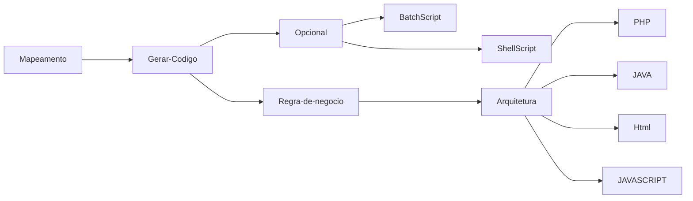

# MapperIdea-JAVA
## Introdução ao Mapperidea 

Aqui esta alguns exercícios do MapperIdea, através das dicas aqui faladas é possível desenvolver sua primeira aplicação de agile code

### Mapperidea
__Finalidade da Ferramenta :__
Agilizar o desenvolvimento de Software com mapas mentais, possibilitando reaproveitamento de código através da arquitetura modelada pelo Desenvolvedor / Analista.
*Ideia : "Criar na unha  apenas uma vez"*


#### Pré-Requisitos Linguagens de programação

-  Linguagem Javascript (Vanilla JS) #JAVASCRIPT ;
-  As linguagens de marcação e estilo #HTML E #CSS ;
-  SpringBoot para o back-End  #JAVA #SPRINGBOOT 
-  Ou Node JS #NODJS

#### Principais conceitos MaperIDea
- O [[XML]]    é de extrema importância pois os documentos gerados pela Estrutura gerada são em mm que é um tipo de arquivo  Em sua base XML.
- O [[XPATH - Básico|Xpath]] é essência para utilização do MI (MapperIdea) , através dele é possível correr os documentos XML. 
- O conceito de [[XQUERY]] facilita o entendimento da aplicação das funções dentro de Mapperidea.

### SOFTWARES UTILIZADOS 
- NODE 12 
- Freemind 1.0 + pacote de icones 

> O mapeamento é um processo em que os membros da equipe de desenvolvimento podem executar, envolve "copiar" o codigo traduzindo-o em mapas mentais, 
> os quais poderão se alterados atualizados uma vez montados, sem necessidade de alterar código "na unha".

Após efetuar os mapeamentos, é necessário executar via linha de comando a geração de códigos, que é uma conversão do codigo mapeado em codigos práticos.




### INSTALAÇÃO E USO DA FERRAMENTA

- Instalar antes o node versão 12 

```npm install mapperidea-cli -g ```

- teste usando o comando 

``` mi -h ```

 - Na sequência utilize  com os dados fornecidos pela Mapperidea para autorizar seus acessos.
```authorize|a <email> <machine> <server>```


### Observações: ###

- inicialize o projeto com o nome do projeto e o nome do arquivo
``` mi init <nome do projeto> <arquivo.mm> ```

- Atualize o projeto subindo as informações para o servidor
``` mi push <nome do projeto> ```

- O fluxo repetitivo do projeto é sempre alterar o arquivo, dar um push no servidor para atualização, e então utilizar o comando para geração de código.


### ICONOGRAFIA ####
Para adicionar um ícone a qualquer um de seus nós em seu mapa mental utilize a tecla de atalho "Alt + I" o qual abrirá uma tela de icones, você poderá clicar no ícone desejado ou poderá utilizar as teclas de talhos. Acompanhe a baixo os ícones mais utilizados para mapeamentos de regra de negócio.

## Package
,
O ícone Package, siginifica pacote, indica diretórios. Todas as vezes que existir esse icone nos mapas mentais significa que existe um diretório, isso ajuda a organizar
e melhorar o entendimento do código.Pela padonização das teclas utilize **A tecla p**


## Direct-to-Field
,
O icone **Direct to Field**, representa o campo de entrada de dados, por exempo: A Classe Vendedor possúi nome, e sobrenome, logo nome e sobrenome apresentarão esses icones de **Direct To Field**, quando no sistema vocês adicionarem esse campo será necessário na Arquitetura do software, identificar o icone e então executar alguma ação, como por exemplo criar um campo input. **Utilize a tecla D**

## Icon-Descriptor-Class
,
Ícone de descrição de classe, em seu nó adicione esse ícone para indicar que é uma classe comum. 

## Icon-Descriptor-Bean
,
Ícone de descrição de classe Bean, em seu nó adicione esse ícone para indicar que é uma classe do tipo Bean.

## Icon-One-to-Many
,
Uma determinada classe pode ter subclasses, inferindo a relação "Um parar muitos", um exemplo simples seria 
uma classe "Orçamento" que contem diversos itens/produtos. como tecla de atalho utilize **alt+o**


