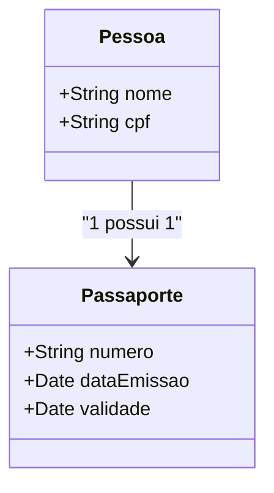

## Exemplo de mapa mental no freemind: Classes e atributos

Para iniciar vamos utilizar os icones de pacote, definindo o nó com o nome "peso" e um sub nó que conterá as classes domainTeste

Perceba os pontos principais dessa classe Carro: 
O ícone class, pode ser utilzado quando a classe não é persistida no banco de dados. 
Nesse exemplo a classe carro contem os atributos, placa, modelo, cor e ano. Após 
cada atributo temos as propriedades, podendo ser texto, Inteiro, ou número.

O @ é interpretado como linhas de orientação para banco de dados e também para titulos que podem ser exibidos posteriormente em tela. 

## Relação entre classes 

As relações entre as classes podem ser definidas como one to one (um para um) / one to many(um para muitos) e many to one (muitos para um). 

#### Relação um para um 
Um exemplo pode ser de uma pessoa que possui um passaporte, ou seja a relação é de um para um, pois um passaporte pode ser de apenas uma pessoa e uma pessoa pode ter apenas um passsaporte.

