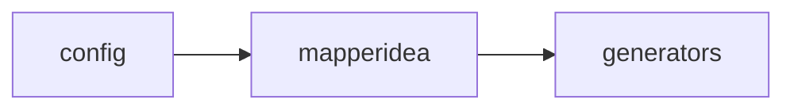
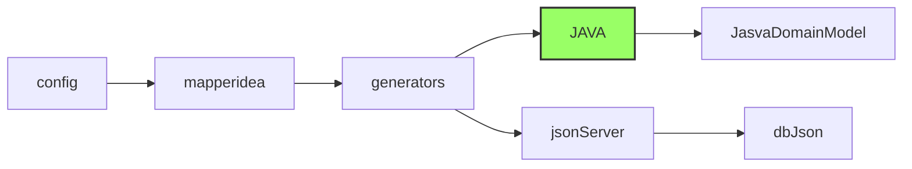

Para mapear códigos é necessário primeiramentes criar nós com as palavras chaves. Lembrese de adicionar a tag element em cada palavra.
**alt + e** 

aṕos os **generators** pode se criar o nome dos geradores que o usuário esteja produzindo, exemṕlo:

