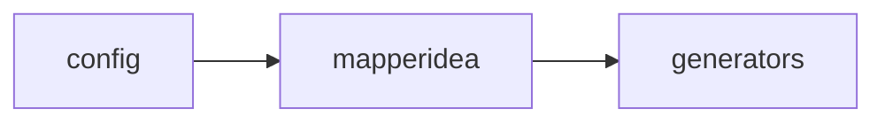
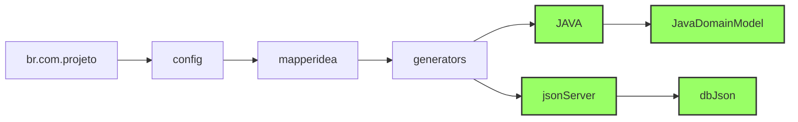

# MAPEAMENTO DE CÓDIGOS.
Para mapear códigos é necessário primeiramentes criar nós com as palavras chaves. Lembrese de adicionar a tag element em cada palavra.
**alt + e** 



Aṕos os **generators** pode se criar o nome dos geradores que o usuário esteja produzindo, esses nomes dependenm de como o arquiteto/Analista decidir. obs. os nomes variaveis estão em verde.



COnhecer a estrutura de código é enssencial para mapear com eficiência.

## Estrutura e mapeamento (geradores)

### patterns
São os padrões, o código que será escrito literalemente.

 ```mermaid
flowchart LR
     JAVA --> domainModelJAVA;
     domainModelJAVA --> patterns;
     patterns --> padraoIncio;
     patterns --> padraoFim;
     padraoIncio --> B["{"];
     padraoFim --> F["}"];
```

