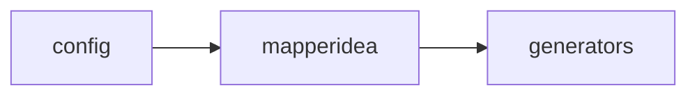

Para mapear códigos é necessário primeiramentes criar nós com as palavras chaves. Lembrese de adicionar a tag element em cada palavra.
**alt + e**

```mermaid
flowchart LR
    config --> mapperidea;
    mapperidea --> generators;
   
```
